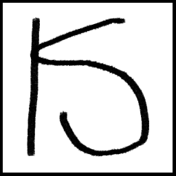

<p align="center">
  
</p>

<h1 align="center">key-statics</h1>

<p align="center">
  A lightweight Windows desktop application that captures global keyboard input and displays a virtual keyboard overlay via HTTP server, designed for OBS Browser Source integration.
</p>

<p align="center">
  <a href="https://www.qt.io/"></a>
  <a href="https://en.wikipedia.org/wiki/C%2B%2B"></a>
  <a href="https://www.gnu.org/licenses/gpl-3.0.html"></a>
  
</p>

---

## Features

- Global keyboard & mouse hook capturing all input
- Virtual keyboard UI with real-time highlighting
- HTTP server (default port 9876) for OBS Browser Source
- Multiple keyboard layout support (JSON-based)
- Key statistics (KPS, total presses)
- System tray icon with layout switching
- Background execution (no visible window)
- Mouse button support (left, right, middle, X1, X2)
- Preview tool for testing layouts

## Quick Start

### Basic Usage with OBS

1. Run `key-statics.exe`
2. Open OBS Studio
3. Add a new "Browser Source"
4. Set URL to: `http://localhost:9876/`
5. Set width: 1000, height: 300 (or adjust as needed)
6. Check "Shutdown source when not visible" to save resources

The keyboard overlay will display key presses in real-time.

### Default Layouts

- **104keys.json** - Full-size 104-key keyboard
- **dfjk.json** - Minimal DFJK layout (4 keys)
- **dfjk-mouse.json** - DFJK layout with mouse buttons

### Switching Layouts

Right-click the system tray icon to switch between available layouts.

## Configuration File

Create a `config.json` file in the same directory as `key-statics.exe`:

```json
{
    "server": {
        "port": 9876,
        "autoPortIfOccupied": true
    },
    "display": {
        "unitWidth": 40,
        "unitHeight": 40,
        "keySpacing": 4,
        "backgroundColor": "#282828",
        "keyColor": "#444444",
        "keyActiveColor": "#0096FF",
        "fontFamily": "monospace"
    },
    "layout": {
        "default": "104keys"
    }
}
```

### Configuration Fields

| Section | Field | Description |
|---------|-------|-------------|
| server | port | HTTP server port (default: 9876) |
| server | autoPortIfOccupied | Auto-select port if occupied |
| display | unitWidth | Key width in pixels |
| display | unitHeight | Key height in pixels |
| display | keySpacing | Gap between keys in pixels |
| display | backgroundColor | Background color (hex) |
| display | keyColor | Key background color (hex) |
| display | keyActiveColor | Key active/pressed color (hex) |
| display | fontFamily | Font family for key labels |
| layout | default | Default layout filename |

## Mouse Support

The application supports mouse button input. Add mouse keys to your layout:

```json
{
    "keys": [
        {"vkCode": 1, "label": "L", "row": 0, "col": 0},
        {"vkCode": 2, "label": "R", "row": 0, "col": 1},
        {"vkCode": 4, "label": "M", "row": 0, "col": 2}
    ]
}
```

### Mouse Virtual Key Codes

| Key | Code |
|-----|------|
| Left Button | 1 |
| Right Button | 2 |
| Middle Button | 4 |
| X1 | 5 |
| X2 | 6 |

## Custom Keyboard Layouts

You can create your own keyboard layout configuration.

### Layout File Format

Create a JSON file in the `layouts/` folder:

```json
{
    "name": "Custom Layout Name",
    "unitWidth": 40,
    "unitHeight": 40,
    "keySpacing": 4,
    "keys": [
        {"vkCode": 68, "label": "D", "row": 0, "col": 0, "width": 1},
        {"vkCode": 70, "label": "F", "row": 0, "col": 1, "width": 1},
        {"vkCode": 74, "label": "J", "row": 0, "col": 2, "width": 1},
        {"vkCode": 75, "label": "K", "row": 0, "col": 3, "width": 1}
    ]
}
```

### Configuration Fields

| Field | Description |
|-------|-------------|
| `name` | Display name for the layout |
| `unitWidth` | Width of a single key unit in pixels |
| `unitHeight` | Height of a single key unit in pixels |
| `keySpacing` | Gap between keys in pixels |
| `keys` | Array of key definitions |

### Key Definition Fields

| Field | Description |
|-------|-------------|
| `vkCode` | Windows virtual key code |
| `label` | Text to display on the key |
| `row` | Row position (0-indexed, supports decimals like 1.5) |
| `col` | Column position (0-indexed, supports decimals) |
| `width` | Key width in units (default: 1) |
| `height` | Key height in units (default: 1) |

### Common Virtual Key Codes

| Key | Code | Key | Code |
|-----|------|-----|------|
| A-Z | 65-90 | F1-F12 | 112-123 |
| 0-9 | 48-57 | Esc | 27 |
| Space | 32 | Enter | 13 |
| Shift | 160/161 | Ctrl | 162/163 |
| Alt | 164/165 | Tab | 9 |

### Using Custom Layouts

1. Place your JSON file in the `layouts/` folder next to the executable
2. Restart the application
3. Select your custom layout from the system tray menu

## API Endpoints

| Endpoint | Description |
|----------|-------------|
| `/` | Main HTML page with keyboard overlay |
| `/events` | Server-Sent Events stream for real-time key updates |

## System Tray Menu

Right-click the system tray icon to access:

- **Switch Layout** - Choose from available layouts (current marked with *)
- **Current** - Shows currently active layout
- **Reset Stats** - Reset key press counters
- **Show/Hide Keyboard** - Toggle overlay window visibility
- **Preview Layout** - Open layout preview tool
- **About** - Application info
- **Exit** - Exit application

## Preview Tool

The preview tool allows you to test layouts without running the main OBS integration:

1. Click **Preview Layout** from the system tray menu
2. A separate window will open showing the keyboard
3. Your key presses will be highlighted in real-time
4. Use the dropdown to switch between different layouts
5. Click **Reset** to clear pressed key states

This is useful for verifying your custom layout bindings before using them in OBS.

## Building from Source

### Prerequisites

- Qt 6.x (with MinGW compiler)
- CMake 3.16+

### Build Commands

```bash
mkdir build && cd build
cmake .. -G "MinGW Makefiles"
mingw32-make
```

### Deployment

Copy the following to your deployment folder:
- `key-statics.exe`
- All `Qt6*.dll` files
- `platforms/` folder (Qt platform plugins)
- `layouts/` folder (keyboard configurations)

## License

This program is free software: you can redistribute it and/or modify it under the terms of the GNU General Public License as published by the Free Software Foundation, either version 3 of the License, or (at your option) any later version.

This program is distributed in the hope that it will be useful, but WITHOUT ANY WARRANTY; without even the implied warranty of MERCHANTABILITY or FITNESS FOR A PARTICULAR PURPOSE. See the GNU General Public License for more details.

You should have received a copy of the GNU General Public License along with this program. If not, see <https://www.gnu.org/licenses/>.

### Acknowledgments

- [Qt Framework](https://www.qt.io/) - Cross-platform UI framework (GPL)
- [Krita](https://krita.org/) - Digital painting application used for icon design
- Windows Hook API for global keyboard capture

## Contributing

This project does not accept Issues or Pull Requests.

If you would like to modify or extend this project, please fork the repository and make your own changes.

---

For OBS streaming, consider adjusting the browser source FPS to 60 for smoother key animations.
